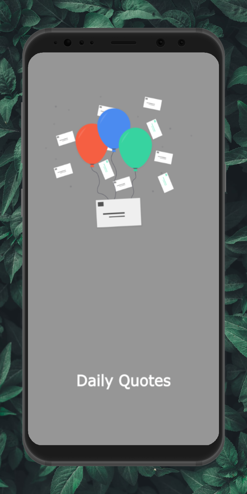
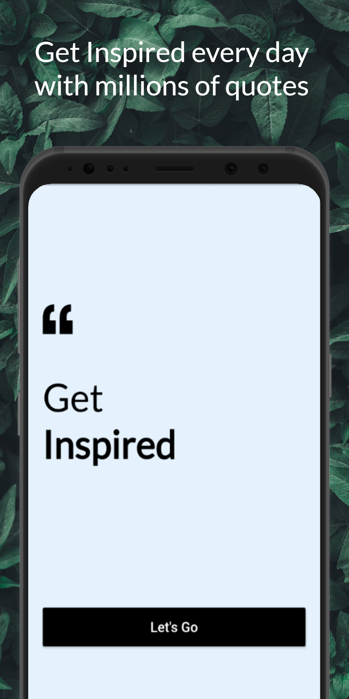
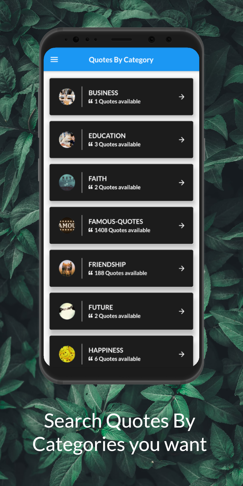
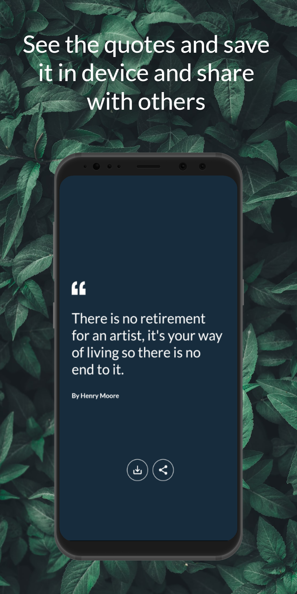
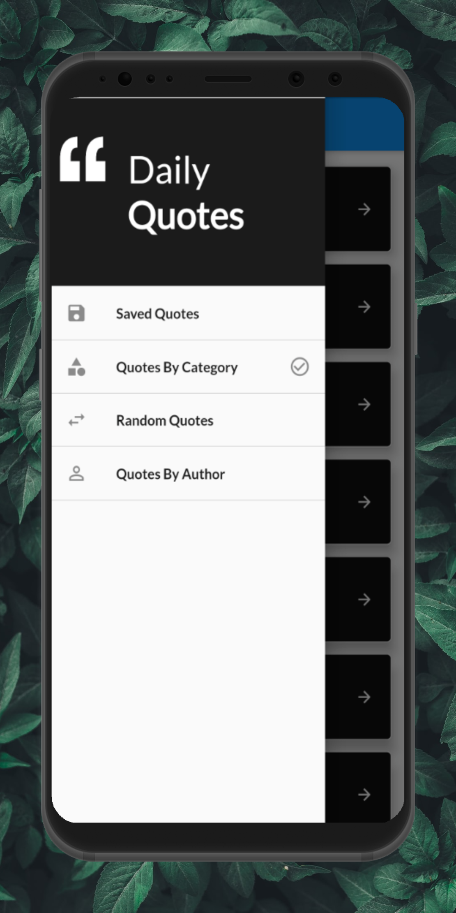
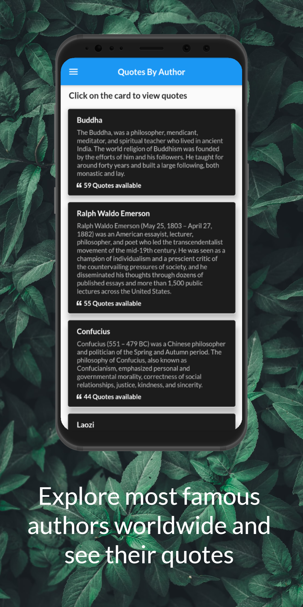
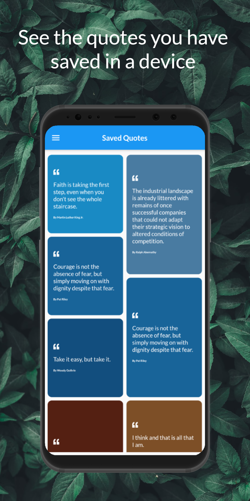
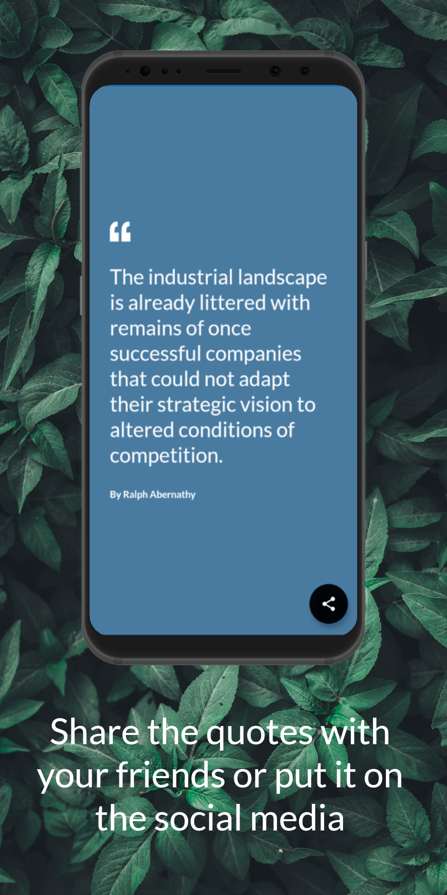

# Daily Quotes - Get Inspired Everyday

     

<h4 align="center">
 🥰 Daily Quotes - Get Inspired Everyday ⛅️
</h4>

 
 

	<h3>Here you can see the demo of the application - <a href="https://youtu.be/tOBycJFvxXw">https://youtu.be/tOBycJFvxXw</a></h3>

    <h3>Features available in the application:</h3>
    👉🏼 Get millions of quotes everyday
	 
    👉🏼 Search quotes by different categories
	 
    👉🏼 Search quotes by world's most famous authors
	 
    👉🏼 Read random quotes
	 
    👉🏼 Save quotes to local device
	 
    👉🏼 Share quotes with your friends
	 
    👉🏼 Share quotes on status and story on any social media from application
	 
    👉🏼 See saved quotes in application
	 
    👉🏼 Firebase notification and in-app messaging
	 
    👉🏼 In-app update when new update comes
	 

 
 

	<table>
		<tr>
			<td style="text-align: center"></td>
			<td style="text-align: center"></td>
		</tr>
		<tr>
			<td style="text-align: center"></td>
			<td style="text-align: center"></td>
		</tr>
		<tr>
			<td style="text-align: center"></td>
			<td style="text-align: center"></td>
		</tr>
		<tr>
			<td style="text-align: center"></td>
			<td style="text-align: center"></td>
		</tr>
	</table>

For help getting started with Flutter, view  
[online documentation](https://flutter.io/docs), which offers tutorials,
samples, guidance on mobile development, and a full API reference.
